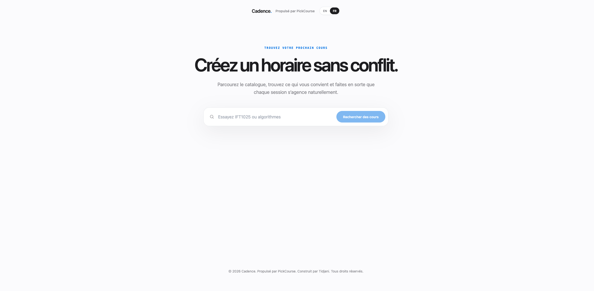
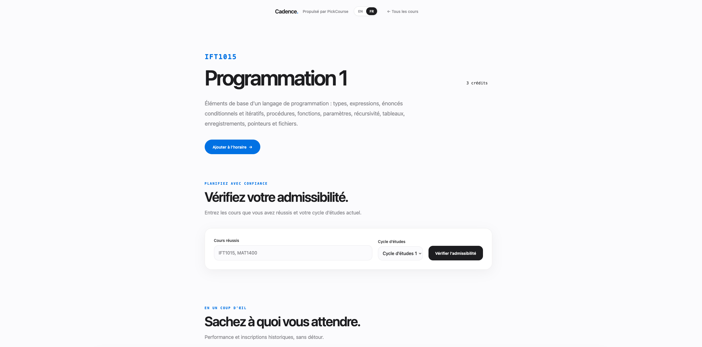
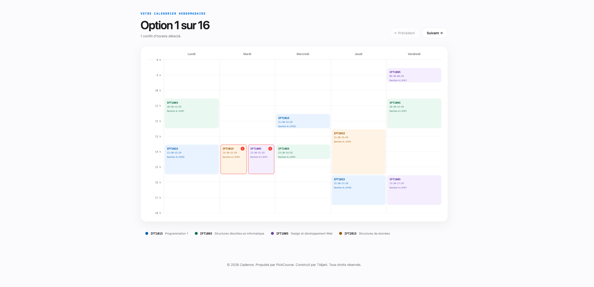

[Read in English](README.md)

# Cadence

**Construire un horaire réaliste avant l'inscription.**

[Démo en ligne](https://cadence-ten-beta.vercel.app)

Cadence est l'interface destinée aux utilisateurs du backend et du dépôt **PickCourse**. Les deux noms désignent le même système à des niveaux différents : Cadence est le produit; PickCourse est l'identité de l'API et du code source.

## Fonctionnalités

Cadence aide les étudiants de l'Université de Montréal à chercher des cours, à consulter leurs détails et à vérifier leur admissibilité selon les cours déjà réussis. Ils peuvent composer un choix de cours, générer des horaires sans conflit et tenir compte des avis étudiants sur la difficulté, la charge de travail et les enseignants.

## Architecture

```text
React + TypeScript             API REST Javalin                 PostgreSQL
Vercel                         Railway                          Railway
┌──────────────┐   HTTPS       ┌──────────────────┐   SQL       ┌─────────────────┐
│ Interface    │ ────────────> │ API PickCourse   │ ──────────> │ avis            │
│ Cadence      │               │                  │             │ cache catalogue │
└──────────────┘               └────────┬─────────┘             └─────────────────┘
                                      │
                                      │ synchro manuelle + admissibilité
                                      ▼
                               ┌──────────────────┐
                               │ API Planifium    │
                               └──────────────────┘
```

L'API sert les cours et les horaires depuis un cache PostgreSQL. Une route d'administration authentifiée actualise les programmes, les cours et les horaires à partir de Planifium; Flyway gère le schéma de la base de données et Jdbi assure l'accès aux données.

## Choix d'ingénierie

### Mettre le catalogue en cache à la frontière du système

Planifium est une dépendance externe sur laquelle le projet n'a aucun contrôle, et sa disponibilité comme la forme de ses réponses ne sont pas assez stables pour l'interroger à chaque requête utilisateur. Conserver le catalogue dans PostgreSQL découple la recherche et la génération d'horaires de cette dépendance, stabilise les temps de réponse et préserve le dernier jeu de données utilisable lorsqu'une synchronisation échoue en amont.

### Dégrader un jeu de données, pas toute l'application

La route `/programs` de Planifium renvoie actuellement un objet de la forme `{"status_code": 500, "detail": "validation error"}`, alors que le contrat de l'API prévoit un tableau JSON de programmes. La synchronisation valide cette structure et isole chaque étape : les programmes peuvent échouer tandis que les cours continuent par `/courses` et les horaires par `/schedules`. La navigation par programme ou segment peut donc être incomplète sans bloquer la recherche de cours, la vérification d'admissibilité ni la création d'horaires.

### Synchroniser à la demande

La synchronisation du catalogue est manuelle plutôt que planifiée. Comme le catalogue change environ une fois par trimestre universitaire, une tâche exécutée en continu ajouterait du calcul, des écritures en base de données et du trafic vers Planifium sans gain de fraîcheur significatif. Une personne autorisée déclenche plutôt l'actualisation avant qu'elle soit nécessaire, notamment avant une démonstration ou un nouveau trimestre.

### Conserver les données imbriquées en JSONB pour la v1

Les réponses de cours, de programmes et d'horaires contiennent des structures imbriquées dont le schéma appartient à Planifium. Cadence place les champs essentiels aux requêtes dans des colonnes relationnelles et conserve les réponses complètes en `JSONB`. Ce compromis évite une normalisation prématurée et de nombreuses jointures en v1, tout en permettant de promouvoir plus tard les champs stables et fréquemment consultés vers des colonnes dédiées.

## Technologies

### Frontend

- React 19 et TypeScript
- Vite
- React Router
- Tailwind CSS
- i18next / react-i18next
- Vercel

### Backend

- Java 17 et Javalin 6
- PostgreSQL avec Jdbi 3
- Migrations de base de données avec Flyway
- Jackson et Gson
- Maven
- JUnit 5, Mockito et Testcontainers
- Railway
- Planifium comme source du catalogue et service d'admissibilité

## Captures d'écran

### Accueil



*Chercher dans le catalogue par sigle ou par titre.*

### Détail d'un cours



*Consulter les exigences et les avis étudiants au même endroit.*

### Générateur d'horaires



*Comparer les combinaisons de sections valides dans un calendrier hebdomadaire.*

## Limites connues

- La route `/programs` de Planifium est actuellement défectueuse en amont. La navigation par programme et par segment est touchée; la recherche de cours, la vérification d'admissibilité et la création d'horaires restent disponibles.
- Le bot Discord de soumission d'avis est inactif parce que ses identifiants sont détenus par un collaborateur. Le formulaire du site web est désormais le principal moyen de soumettre un avis.
- La couverture des cours correspond aux données actuellement offertes par Planifium : la Faculté des arts et des sciences de l'Université de Montréal.

## Installation locale

### Prérequis

- Java 17
- Maven 3.9+
- Node.js 20+ et npm
- PostgreSQL 16 ou une instance PostgreSQL compatible
- Docker, seulement pour les tests d'intégration du backend qui utilisent Testcontainers

### Backend

Créez une base de données PostgreSQL vide, puis fournissez les paramètres de connexion. Flyway applique les migrations du schéma au démarrage de l'API.

```bash
cd implementation

export PICKCOURSE_DB_URL='jdbc:postgresql://localhost:5432/pickcourse'
export PICKCOURSE_DB_USER='pickcourse'
export PICKCOURSE_DB_PASSWORD='devpassword'
export PICKCOURSE_ADMIN_TOKEN='remplacer-par-un-jeton-local'

mvn -DskipTests package
java -jar target/IFT2255_Implementation-1.0-SNAPSHOT.jar
```

L'API écoute sur `http://localhost:7070`. Si les variables de base de données sont absentes, les valeurs ci-dessus sont utilisées par défaut. `PICKCOURSE_ADMIN_TOKEN` n'a aucune valeur par défaut et doit être défini pour autoriser la synchronisation du catalogue.

Pour exécuter les tests du backend, Docker doit être disponible :

```bash
cd implementation
mvn clean test
```

### Frontend

```bash
cd frontend
npm install

printf 'VITE_API_BASE_URL=http://localhost:7070\n' > .env.local
npm run dev
```

Vite sert le frontend sur `http://localhost:5173`. `VITE_API_BASE_URL` doit contenir l'origine de l'API sans barre oblique finale. Sans redéfinition locale, le frontend utilise l'API déployée sur Railway.

Pour produire la version de déploiement :

```bash
cd frontend
npm run build
```

## Synchronisation administrative du catalogue

Lancez une actualisation du catalogue avec la route d'administration authentifiée :

```bash
curl -X POST http://localhost:7070/admin/sync \
  -H "X-Admin-Token: $PICKCOURSE_ADMIN_TOKEN"
```

Une requête valide renvoie `202 Accepted` avec `Sync started`; la synchronisation se poursuit de façon asynchrone. Le jeton transmis dans `X-Admin-Token` doit correspondre exactement à la variable `PICKCOURSE_ADMIN_TOKEN` du backend. Une actualisation complète peut prendre **de 30 à 60 minutes, voire davantage**, car elle parcourt le catalogue et les horaires. Il faut donc la déclencher avant une démonstration ou un changement de trimestre, jamais pendant.
