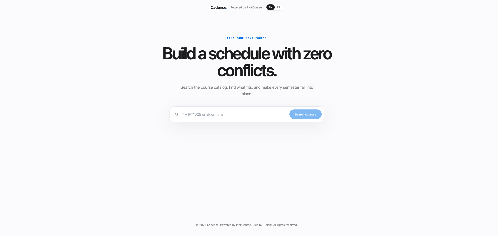
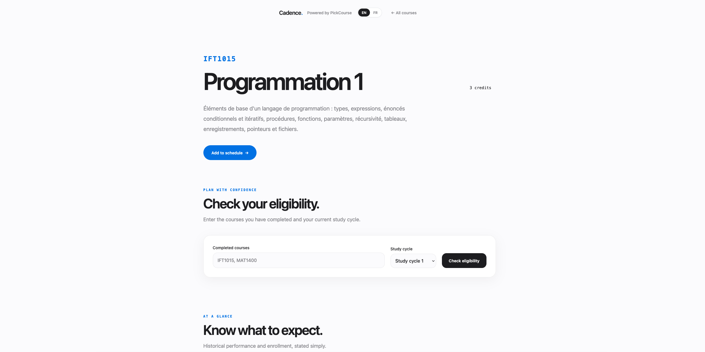
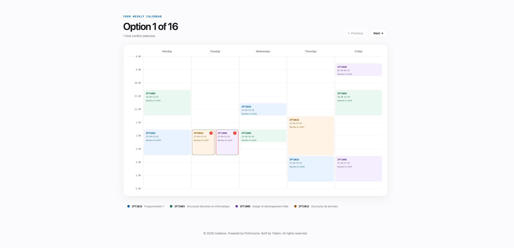

[Lire en français](README.fr.md)

# Cadence

**Build a workable course plan before registration.**

[Live demo](https://cadence-ten-beta.vercel.app)

Cadence is the product-facing frontend for the **PickCourse** backend and repository. The two names refer to the same system at different layers: Cadence is the user-facing product; PickCourse is the API and codebase identity.

## What it does

Cadence helps Université de Montréal students search the course catalog, inspect course details, and check eligibility against completed coursework. Students can assemble candidate course sets, generate conflict-free schedule options, and use crowdsourced difficulty, workload, and instructor reviews when making decisions.

## Architecture

```text
React + TypeScript             Javalin REST API                 PostgreSQL
Vercel                         Railway                          Railway
┌──────────────┐   HTTPS       ┌──────────────────┐   SQL       ┌─────────────────┐
│ Cadence UI   │ ────────────> │ PickCourse API   │ ──────────> │ reviews         │
│              │               │                  │             │ catalog cache   │
└──────────────┘               └────────┬─────────┘             └─────────────────┘
                                      │
                                      │ manual sync + eligibility checks
                                      ▼
                               ┌──────────────────┐
                               │ Planifium API    │
                               └──────────────────┘
```

The API serves course and schedule reads from a PostgreSQL catalog cache. An authenticated admin endpoint refreshes programs, courses, and schedules from Planifium; Flyway owns the database schema and Jdbi handles data access.

## Notable engineering decisions

### Cache the catalog at the system boundary

Planifium is an upstream dependency outside this project's control, and its availability and response shape have not been stable enough to place on every user request. Persisting the catalog in PostgreSQL decouples search and schedule generation from that dependency, gives the application predictable latency, and preserves the last usable dataset when an upstream synchronization pass fails.

### Degrade by dataset, not by application

Planifium's `/programs` endpoint currently returns an object shaped like `{"status_code": 500, "detail": "validation error"}` where the API contract requires a JSON array of programs. The sync process validates that shape and isolates each pass: programs may fail while courses continue through `/courses`, and schedules continue through `/schedules`. As a result, program and segment browsing can be incomplete without taking down course search, eligibility checks, or schedule construction.

### Synchronize on demand

Catalog synchronization is manual rather than scheduled. The underlying catalog changes roughly once per semester, so a continuously scheduled job would add compute, database writes, and upstream traffic without improving freshness in a meaningful way. An administrator triggers a refresh before the data is needed, particularly ahead of a demonstration or a new semester.

### Keep nested upstream data as JSONB in v1

Course, program, and schedule payloads contain nested structures whose schema is owned by Planifium. Cadence stores query-critical fields relationally while retaining complete upstream payloads in `JSONB`. This avoids premature normalization and a large join surface in v1, while leaving room to promote stable, frequently queried fields into relational columns later.

## Tech stack

### Frontend

- React 19 and TypeScript
- Vite
- React Router
- Tailwind CSS
- i18next / react-i18next
- Vercel

### Backend

- Java 17 and Javalin 6
- PostgreSQL with Jdbi 3
- Flyway database migrations
- Jackson and Gson
- Maven
- JUnit 5, Mockito, and Testcontainers
- Railway
- Planifium as the upstream catalog and eligibility service

## Screenshots

### Landing



*Search the catalog by course code or title.*

### Course Detail



*Review course requirements and student feedback in one place.*

### Schedule Builder



*Compare valid section combinations on a weekly calendar.*

## Known limitations

- Planifium's `/programs` endpoint is currently broken upstream. Program and segment browsing are affected; course search, eligibility checking, and schedule building remain available.
- The Discord review-submission bot is inactive because its credentials are held by a collaborator. The website review flow is the primary submission path.
- Course coverage follows Planifium's current dataset: the Université de Montréal Faculty of Arts and Sciences.

## Local setup

### Prerequisites

- Java 17
- Maven 3.9+
- Node.js 20+ and npm
- PostgreSQL 16 or a compatible PostgreSQL instance
- Docker, only when running the backend integration tests that use Testcontainers

### Backend

Create an empty PostgreSQL database and provide the connection settings. Flyway applies the schema migrations when the API starts.

```bash
cd implementation

export PICKCOURSE_DB_URL='jdbc:postgresql://localhost:5432/pickcourse'
export PICKCOURSE_DB_USER='pickcourse'
export PICKCOURSE_DB_PASSWORD='devpassword'
export PICKCOURSE_ADMIN_TOKEN='replace-with-a-local-admin-token'

mvn -DskipTests package
java -jar target/IFT2255_Implementation-1.0-SNAPSHOT.jar
```

The API listens on `http://localhost:7070`. If the database variables are omitted, the values shown above are the backend defaults. `PICKCOURSE_ADMIN_TOKEN` has no default and must be set to authorize catalog synchronization.

Run the backend tests with Docker available:

```bash
cd implementation
mvn clean test
```

### Frontend

```bash
cd frontend
npm install

printf 'VITE_API_BASE_URL=http://localhost:7070\n' > .env.local
npm run dev
```

Vite serves the frontend at `http://localhost:5173`. `VITE_API_BASE_URL` should be the API origin without a trailing slash. Without an override, the frontend uses the deployed Railway API.

For a production build:

```bash
cd frontend
npm run build
```

## Admin catalog sync

Start a catalog refresh with the authenticated admin endpoint:

```bash
curl -X POST http://localhost:7070/admin/sync \
  -H "X-Admin-Token: $PICKCOURSE_ADMIN_TOKEN"
```

A valid request returns `202 Accepted` with `Sync started`; synchronization continues asynchronously. The token in `X-Admin-Token` must exactly match the backend's `PICKCOURSE_ADMIN_TOKEN`. A full refresh can take **30-60 minutes or longer** because it traverses the catalog and schedule data, so trigger it ahead of a demo or semester update, not during one.
