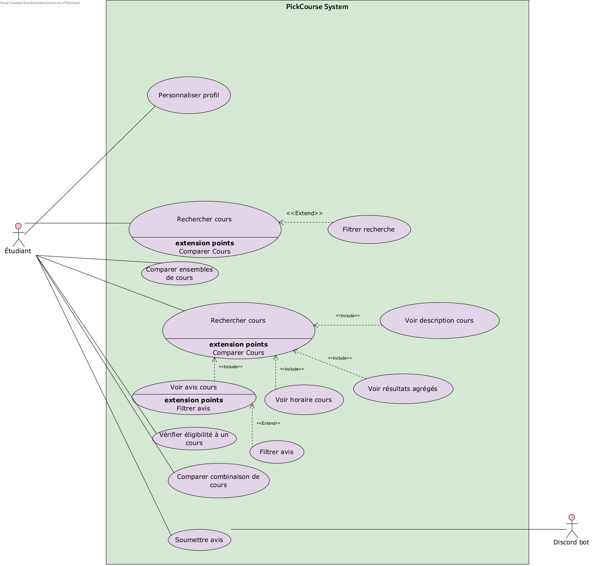

# Cas d'utilisation

## Vue d’ensemble

## Liste des cas d’utilisation

| ID | Nom | Acteurs principaux | Description |
|----|-----|---------------------|-------------|
| CU01 | Personnaliser son profil | Utilisateur | L'utilisateur personnalise son profil lors de la création de compte |
| CU02 | Modifier profil | Utilisateur | L'utilisateur modifie les informations de son profil |
| CU03 | Rechercher un cours | Utilisateur | L'utilisateur recherche un cours par sigle, nom ou mot-clé |
| CU04 | Voir les avis | Utilisateur | L'utilisateur consulte la liste des avis d’un cours |
| CU05 | Filtrer la recherche | Utilisateur | L'utilisateur filtre les résultats selon ses préférences |
| CU06 | Voir les informations officielles | Utilisateur | L'utilisateur consulte les détails d’un cours |
| CU07 | Comparer combinaison de cours | Utilisateur | Le système permet d'évaluer la charge de travail d'une combinaison de cours |
| CU08 | Comparer ensembles de cours | Utilisateur | Le système permet de comparer la charge de travail de plusieurs ensembles de cours |

## Détail

### CU01 - Personnaliser profil

**Acteurs** : Étudiant (principal)  
**Préconditions** : L'utilisateur a amorcé le processus de création de compte  
**PostConditions** : Des paires (propriété, valeur) relatives aux préférences de l'utilisateur fournies sont stockées dans la base de données  
**Déclencheur** : L'utilisateur a cliqué sur "continuer"  
**Dépendances** : Ce CU est étroitement lié au CU "créer compte"  
**But** : Un utilisateur souhaite avoir une expérience fluide et personnalisée.

---

### CU02 - Modifier profil

**Acteurs** : Étudiant (principal)  
**Préconditions** : L'utilisateur doit déjà avoir un compte et être connecté sur ce dernier  
**PostConditions** : Son profil est mis à jour dans la base de données 
**Déclencheur** : L'utilisateur a cliqué sur "modifier profil" dans les Paramètres  
**Dépendances** : Ce CU est lié au CU "créer compte" et "se connecter"  
**But** : L'utilisateur souhaite mettre à jour les données de son profil

---

---

### CU03 - Rechercher cours

**Acteurs** : Utilisateur (principal)  
**Préconditions** : L'utilisateur doit être connecté sur son compte qu'il a au préalable créé  
**PostConditions** : La requête à l'API Planifium a été réalisée avec succès et la page du cours s'affiche  
**Déclencheur** : L'utilisateur clique sur la barre de recherche  
**Dépendances** : Ce CU dépend du CU "créer compte", "se connecter"  
**But** : L'utilisateur souhaite voir les informations relatives à un cours avant de s'y inscrire

---

### CU04 - Voir avis

**Acteurs** : Utilisateur (principal)  
**Préconditions** : L'utilisateur doit être connecté sur son compte qu'il a au préalable créé, et doit avoir recherché (ou sélectionné) un cours  
**PostConditions** : La requête au bot Discord a été réalisée avec succès et la page des avis du cours s'affiche  
**Déclencheur** : L'utilisateur clique sur "Avis"  
**Dépendances** : Ce CU dépend du CU "créer compte", "se connecter" et "rechercher cours"  
**But** : L'utilisateur souhaite voir les avis des anciens étudiants pour prendre sa décision.

---

### CU05 - Filtrer la recherche

**Acteurs** : Utilisateur (principal)  
**Préconditions** : L'utilisateur doit être connecté sur son compte qu'il a au préalable créé, et doit avoir ou non effectué une recherche  
**PostConditions** : La requête à l'API Planifium a été réalisée avec succès et le résultat filtré s'affiche  
**Déclencheur** : L'utilisateur a cliqué sur l'icône de filtre  
**Dépendances** : Ce CU dépend du CU "créer compte", "se connecter" et peut-être "rechercher cours" si la recherche a été faite avant le filtrage  
**But** : L'utilisateur souhaite avoir des résultats qui répondent à certains critères.

---

### CU06 - Voir informations officielles

**Acteurs** : Utilisateur (principal)  
**Préconditions** : L'utilisateur doit être connecté à son compte qu'il a créé ou non (utilisateur visiteur) et doit être sur la page d'un cours  
**PostConditions** : La requête à Planifium a été effectuée avec succès et la description du cours s'affiche  
**Déclencheur** : L'utilisateur clique sur "Description"  
**Dépendances** : Ce CU dépend du CU "se connecter"  
**But** : L'utilisateur veut accéder à la description détaillée des cours

---

### CU07 - Comparer combinaison de cours

**Acteurs** : Utilisateur (principal)  
**Préconditions** : L'utilisateur est connecté à son compte qu'il a au préalable créé  
**PostConditions** : Des requêtes à Planifium et à Discord via le bot ont été réalisées avec succès  
**Déclencheur** : L'utilisateur va dans la section "comparaison"  
**Dépendances** : Ce CU dépend des CU "créer compte" et "se connecter"  
**But** : L'utilisateur veut choisir des cours dont la charge de travail totale est réalisable

---
### CU07 - Comparer ensembles de cours

**Acteurs** : Utilisateur (principal)  
**Préconditions** : L'utilisateur est connecté à son compte qu'il a au préalable créé  
**PostConditions** : Des requêtes à Planifium et à Discord via le bot ont été réalisées avec succès  
**Déclencheur** : L'utilisateur va dans la section "comparaison"  
**Dépendances** : Ce CU dépend des CU "créer compte" et "se connecter"  
**But** : L'utilisateur veut choisir des cours dont la charge de travail totale est la meilleure

### CU08 - Soumettre un avis

**Acteurs** : Étudiant (principal)  
**Préconditions** : L'utilisateur a déjà suivi le cours concerné  
**PostConditions** : L’avis est ajouté à la base de données et visible pour les autres utilisateurs  
**Déclencheur** : L'utilisateur clique sur "Publier un avis"  
**Dépendances** : Ce CU dépend du CU "se connecter" et "rechercher cours"  
**But** : L'utilisateur souhaite partager son expérience sur un cours

## Diagramme

 *Diagramme de cas d'utilisation*