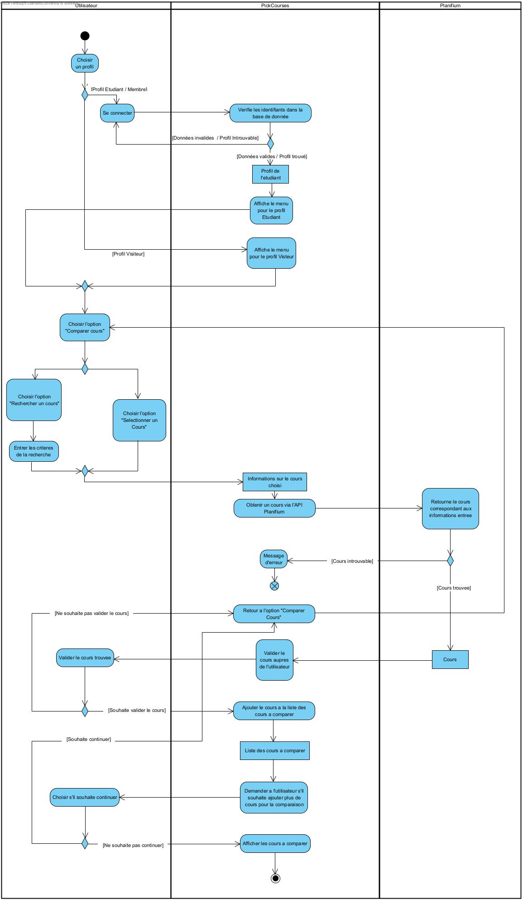
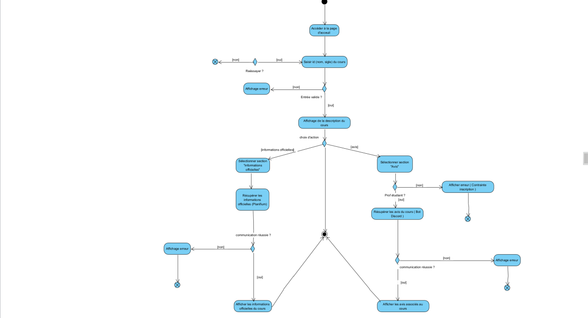

# Flux d’interaction entre les acteurs et le système

## Flux 1 : Voir les avis d'un cours
1. L'utilisateur recherche un cours.
2. Le système vérifie la validité de la recherche.
3. Le système affiche la page associée au cours.
4. L'utilisateur clique sur la section "Avis".
5. Le système affiche les avis dans la mesure du possible (au moins 5).
6. L'utilisateur consulte les avis.

### Scénarios alternatifs
- **2.a L'entrée est invalide**
  1. Le système indique qu'aucun cours ne correspond à la recherche et fait une proposition de résultats.
  2. L'utilisateur sélectionne un cours de la liste.
  3. Le scénario reprend à l'étape 3.
  - **2.a.2.a Aucun des cours de la liste ne correspond au cours recherché**
    - Le scénario reprend à l'étape 1.
- **5.a Pas assez d'avis associés au cours (moins de 5)**
  1. Le système indique qu'il n'y a aucun avis pour le cours et propose à l'utilisateur de poster un avis.
  2. L'utilisateur poste un avis.
    - **5.a.2.a L'utilisateur ne poste pas d'avis**
      - Le scénario se termine.

---

## Flux 2 : Voir les informations officielles associées à un cours
1. L'utilisateur recherche un cours.
2. Le système vérifie la validité de la recherche.
3. Le système affiche la page associée au cours.
4. L'utilisateur clique sur la section "Informations".
5. Le système affiche les informations officielles associées au cours.
6. L'utilisateur consulte les informations officielles.

### Scénarios alternatifs
- **2.a L'entrée est invalide**
  1. Le système indique qu'aucun cours ne correspond à la recherche et fait une proposition de résultats.
  2. L'utilisateur sélectionne un cours de la liste.
  3. Le scénario reprend à l'étape 3.
  - **2.a.2.a Aucun des cours de la liste ne correspond au cours recherché**
    - Le scénario reprend à l'étape 1 (et si le user ne veut plus faire de recherche ?)
- **5.a Le système n'a pas pu récupérer les informations associées au cours**
  1. Le système indique que les informations ne sont pas disponibles et propose à l'utilisateur de consulter les avis plutôt.
  2. Appel du cas *consulter les avis*.
    - **5.a.1.a L'utilisateur ne veut pas consulter les avis**
      - Le scénario se termine.

---

## Flux 3 : Comparer cours
1. L'utilisateur sélectionne l'option "Comparer Cours".
2. L'utilisateur recherche les cours qu'il veut comparer et les ajoute.
3. Le système vérifie la validité de la recherche.
4. L'utilisateur sélectionne les critères de comparaison.
5. Le système vérifie la validité de la recherche.
6. Le système affiche les informations relatives à l'ensemble des cours sous forme de tableau, suivant les critères.

### Scénarios alternatifs
- **3.a L'entrée est invalide**
  1. Le système indique que les identifiants de cours sont invalides et invite l'utilisateur à réessayer.
  2. Le scénario reprend à l'étape 2.
- **5.a L'entrée est invalide**
  1. Le système indique que les critères ne sont pas valides et affiche la liste des critères autorisée.
  2. Le scénario reprend à l'étape 4.

---

## Flux 4 : Rechercher un cours
1. L’utilisateur saisit l'id du cours qu'il veut rechercher.
2. Le système fait appel au service de Cours pour valider l'id.
3. Le système consulte le répertoire de Cours pour obtenir le cours.
4. Le système retourne le cours correspondant.
5. Le système affiche le résultat.

#### Scénarios alternatifs
- **1.a.1 L'utilisateur saisit le nom du cours**
  1. Le système fait appel au service de Cours pour valider le nom du cours.
  2. Le scénario reprend à l'étape 3.
- **1.a.2 L'utilisateur recherche le cours par mot clé**
  1. Le système consulte le répertoire de Cours pour obtenir la liste de cours contenant ce mot clé.
  2. Le système affiche la liste de cours.
- **2.a L'entrée de l'utilisateur est invalide**
  - Le système affiche un message d'erreur.
- **3.a L'API Planifium a une panne**
  1. Le système recherche le cours dans la base de donnée.
  2. Le scénario reprend à l'étape 5.
- **3.b Le cours n'existe pas dans Planifium**
  - Le système retourne un message signalant que le cours n'existe pas.
- **3.a.1 Le cours n'existe pas dans la base de donnée**
  - Le système retourne un message signalant que le cours n'existe pas.

## Diagrammes

 *Diagramme pour les cas d'utilisation "Comparer Cours"*

 *Diagramme pour les cas d'utilisation "Voir Avis, consulter cours"*

