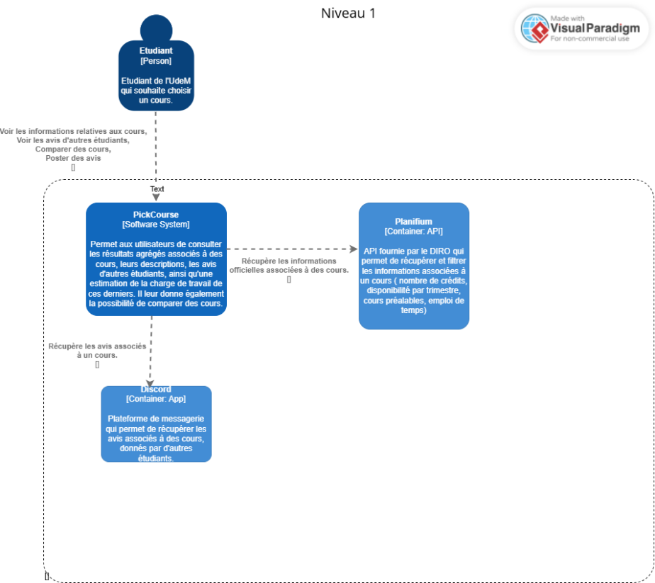
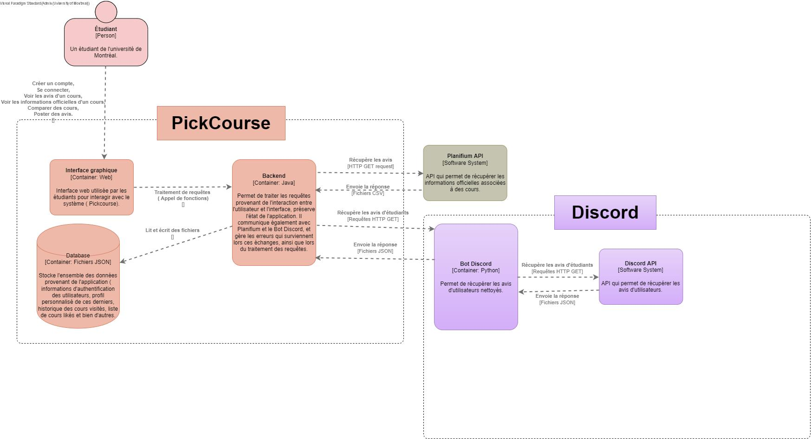
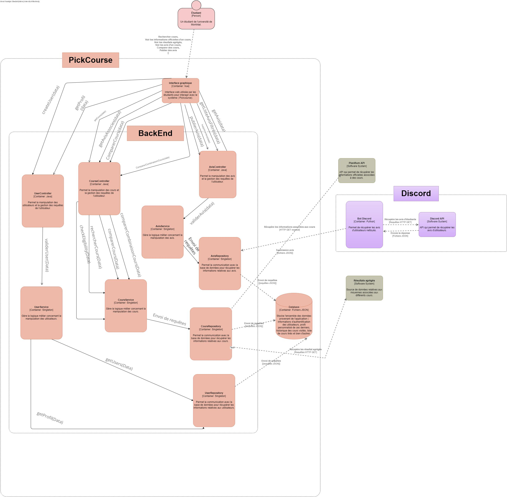

# Architecture du système

## Vue d’ensemble

Nous avons choisi une architecture MVC (Modèle–Vue–Contrôleur) afin d’assurer une séparation nette des responsabilités dans l’application.

Le **Modèle** regroupe la logique métier et les structures de données centrales, ce qui facilite l’évolution et la maintenabilité du code. Le **Contrôleur** gère les requêtes provenant de l’utilisateur ou du client (API), ce qui permet de traiter celles-ci sans mélanger la logique fonctionnelle avec la présentation. La **Vue** est responsable du formatage de la réponse, ce qui isole l’interface des règles métier. Dans cette première phase, cette dernière n'a pas été ajoutée car on s'est limités au développement de l'API REST.

Cette séparation rend l’application plus modulaire, plus facile à tester et plus simple à faire évoluer, des caractéristiques importantes pour un projet dans lequel plusieurs fonctionnalités doivent interagir mais rester indépendantes.
À cette architecture MVC, nous avons ajouté une architecture REST pour structurer les échanges entre le client et le serveur. REST apporte : de la **flexibilité**, car chaque ressource peut être consultée ou modifiée indépendamment via des endpoints définis, de la **scalabilité**, car le modèle stateless facilite la distribution de la charge et le déploiement sur différents environnements, de **l’interopérabilité**, car les données sont échangées dans des formats standards (JSON), ce qui permet à différents systèmes ou clients de communiquer facilement avec notre service.

Ces propriétés répondent directement aux exigences non fonctionnelles du devoir, notamment la modularité, l’évolutivité et la facilité d’intégration.

## Composants principaux

Les composants principaux sont les suivants :
-   Le backend : qui regorge entre autres les controllers ( associés aux entités Cours, Avis et User) organisés en repositories et en services, ainsi que les entités;
-   L'API Planifium : principale source de données pour les cours.
-   Le bot Discord : qui se chargera de la soumission d'avis;
-   Les résultats agrégés : source de données importante sur les informations liées aux cours.
## Communication entre composants

Les composants communiquent via **des appels HTTP** ( par exemple entre CoursRepository et Planifium), et s'échangent des données **sous format JSON** ( les réponses aux requêtes sur Planifium sont sous format json, ainsi que les avis récoltés par le bot). 

## Diagramme d’architecture (Modèle C4)

 *Diagramme pour le niveau 1 du modèle C4*.

 *Diagramme pour le niveau 2 du modèle C4*.

 *Diagramme pour le niveau 3 du modèle C4*.
