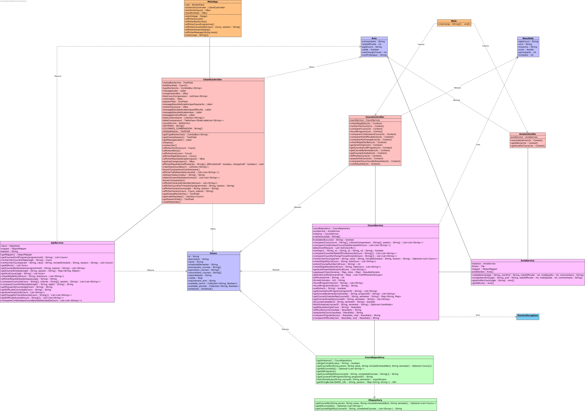
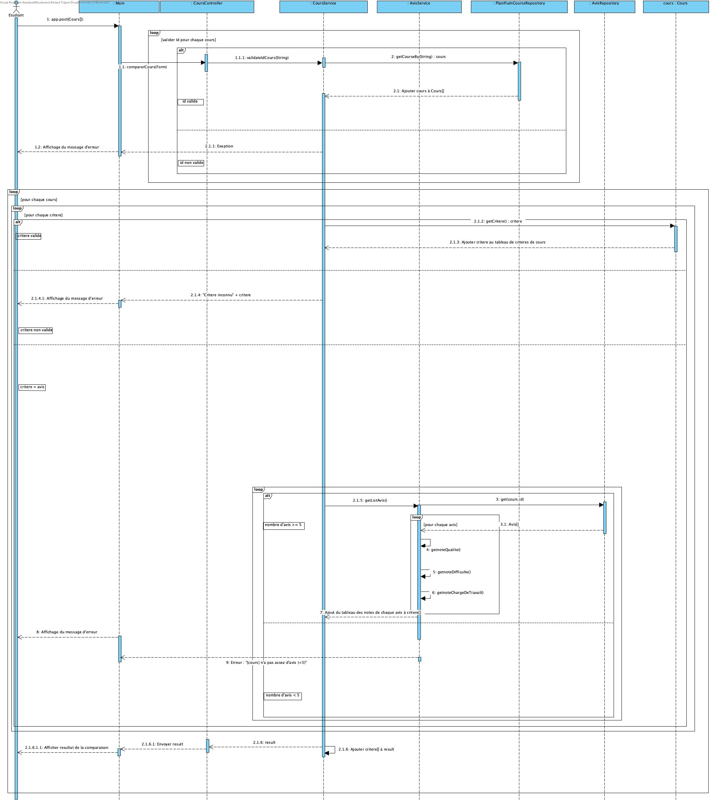
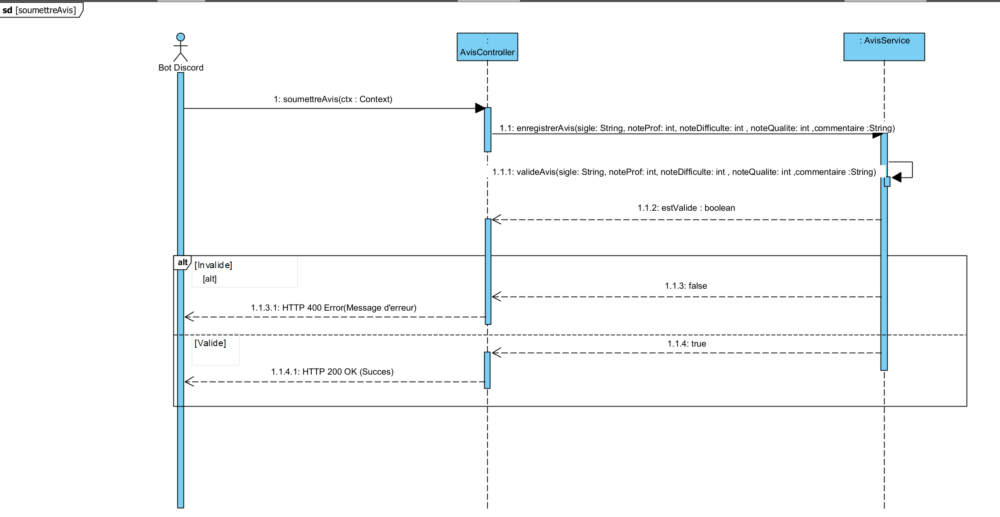

# Diagrammes UML

## Diagrammes de classes

NB : La classe Form ici peut par exemple correspondre à Context, dans le sens où cette dernière contient non seulement la requête mais aussi la réponse à cette dernière.

Nous utilisons plusieurs couleurs différentes car en se basant sur les exemples donnés en cours, on a constaté que les services et repositories ne font pas vraiment partis du controller.

## Diagrammes de séquence

- Comparer cours : 

- Soumettre avis :

- Rechercher cours :

